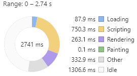
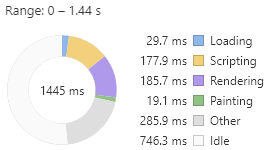
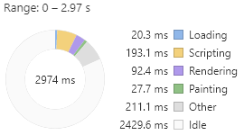
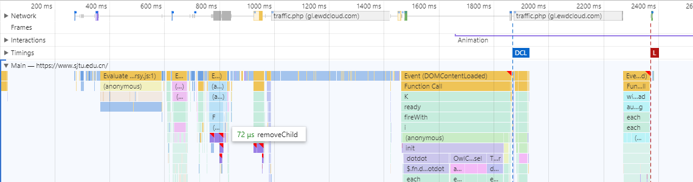
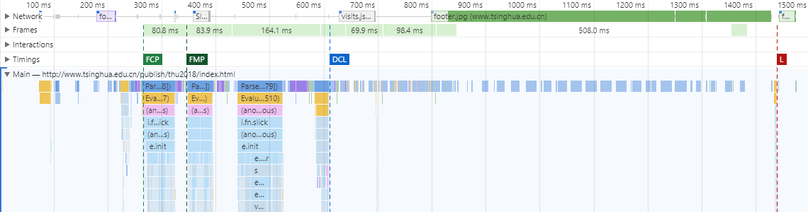
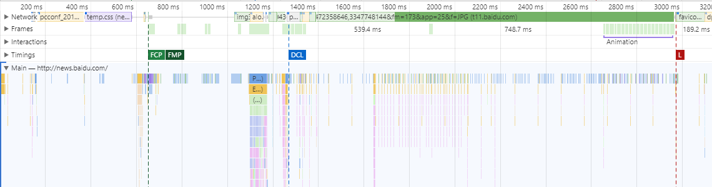
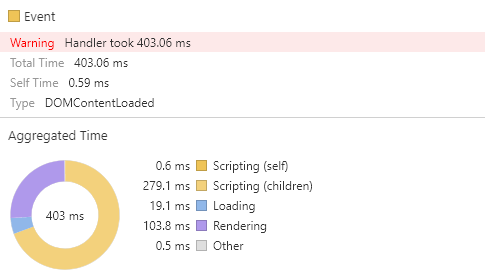

# Homework 2 -- Analyze the home page loading of SJTU

## 0. Requirements

1. Compare with other website home page
2. Carry out your optimization solution

## 1. Comparation

I tried to compare the loading time between homepage of SJTU, THU and Baidu News. Intuitively speaking, SJTU's page seems to be the slowest.

### 1.1 Loading Summary
The following pictures are loading summary of homepage of SJTU, THU and Baidu News with cache disabled. Every summary is from 0 second to `Onload` event.

 
Loading summary of SJTU/THU/Baidu News

In summary we can find that the loading time of SJTU's homepage is much longer than that of other two homepages, but not very long in absolute terms. So it's not the main reason for a slowest loading.

Then we see the **Scripting time**. In fact this is the **slowest part** in loading of SJTU's page. It's so long in terms of relative and absolute values. So now we can get a bit of information: the code has been running too long.

### 1.2 Events

These screenshots show the meaningful events in loading process.

  
SJTU's page

  
THU's page

  
Page of Baidu News

By contrast, the `DCL` event on sjtu's page came the slowest. `DCL` means `DOMContentLoaded`. After `DCL`, the page is displayed normally, only some pictures have not been loaded yet. So **sensorily**, although the Baidu News `Onload` evnet came the slowest, the SJTU page looks the slowest.

Besides, the `DCL` event in SJTU's page takes such a long time that devtool of chrome gives a waring.
  
From the observation, we can see that the page of SJTU will load the page as a whole at the end, while the loading process of the other two pages is scattered, which is also a problem affecting performance.

### 1.3 Other information

According to observation, thu's page elements are the fewest, thus obtaining the fastest load and scripting time, while Baidu news's elements are many, but the structure of the page is simpler, and they are loaded separately, and the latter elements hardly affect the display effect.

## 2. Optimization solution

### 2.1 Optimize the loading time

The amount of pictures in SJTU's page is larger than that of other two pages, this leads to a longer loading time, but the pictures are needed to show contents, if the layout and design concept can't be changed, then the loading process may can be accelerated by properly compressing images and optimizing server responses.

### 2.2 Optimize the rendering time

The current rendering process of SJTU homepage is to render a small part first, then wait, and then render every thing remaining at once, which will cause abnormal display for a period of time.

       
The comparation between finished page and page in loading of SJTU.

       
The comparation between finished page and page in loading of Baidu News.

To optimize this, we can use the method of scattering the rendering. First render the elements in the first page that the user will see imediately, then render the remaining things.