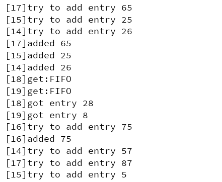
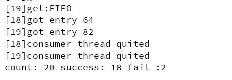

# Task IV - A Simple Container Simulation

## What will the simulation do

The main class will start 4 producer threads and 2 consumer threads. Producing and consuming 20 entries in total.

When running the simulation, program will print log of ops in a format as `[TID]log information`

## Evaluation

In the end, main thread will print a summary of all get entry tries. 

